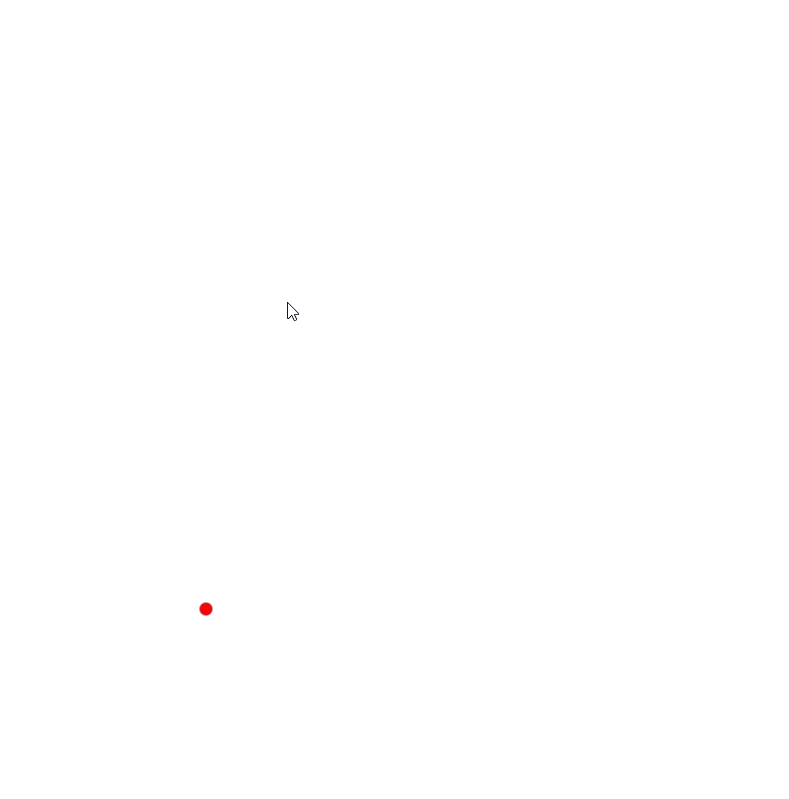

# 曲线生成算法

## 依赖
- win10 (linux mac需要自己配置环境)
- MingGW compiler (32位版本)
- Visual Studio Code
- opengl(glad, glfw), glm

## 已实现功能
- 可编辑bezier曲线和B样条曲线
- 可控制的行值点和颜色提示
- 条状带的生成与修改

## 待实现功能
- 曲线拼接和条状带拼接
- 图元的表示与存储

## 运行指南
1. 安装VScode
2. 安装MingGW（32位版本），将MingGW安装位置的bin文件夹路径加入到环境变量PATH中，官网网速不好，推荐直接安装包含MingGW的CodeBlocks
3. git clone 本仓库到本地
4. 用VScode打开项目文件夹，菜单Terminal->Configure Default Build Task，选择Build&run。
5. Ctrl+Shift+B编译运行

## 操作方法
- 鼠标右键可以在鼠标位置新建控制点
- 鼠标左键可以拖动现有的控制点
